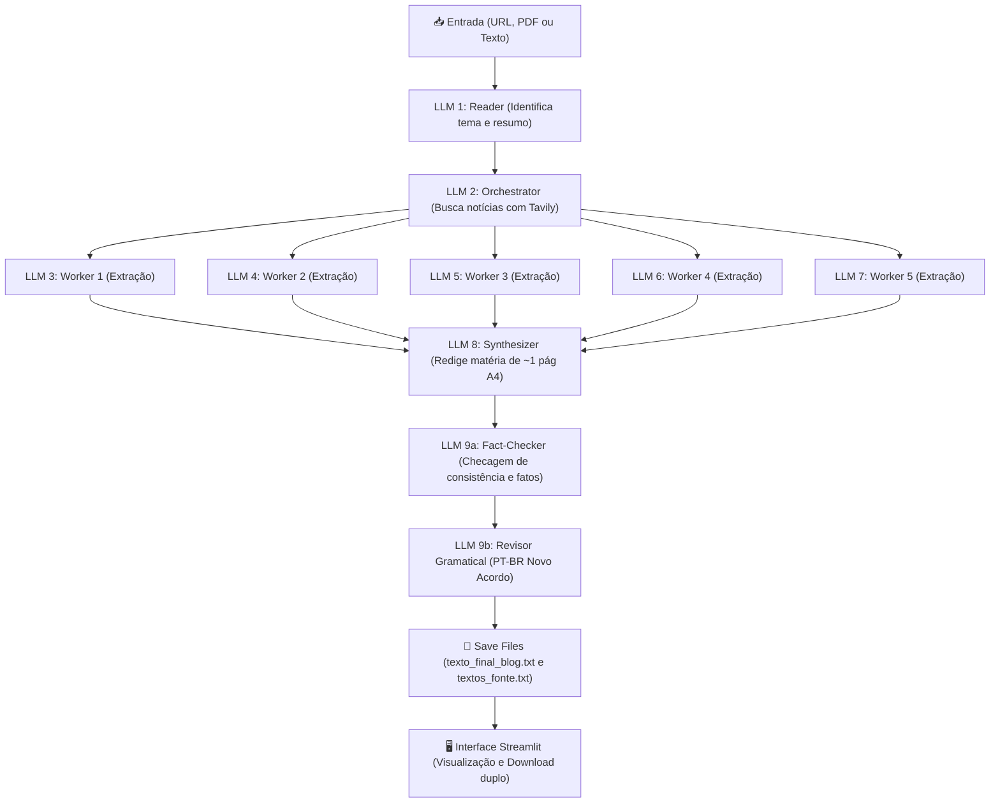

# 📝 Agente de Blog — Arquitetura Orchestrator-Workers

Sistema inteligente para geração de artigos e matérias jornalísticas sóbrias, aprofundadas e factualmente verificadas a partir de links de notícias, arquivos PDF ou textos diretos.

O projeto utiliza **LangGraph** para orquestrar um pipeline multi-agente (*Orchestrator-Workers*), combinando modelos de linguagem (**OpenAI** e **Google Gemini**), pesquisa de fatos em tempo real via **Tavily Search API** e interface visual interativa em **Streamlit**.

---

## 🧠 Arquitetura do Fluxo Multi-Agente

O fluxo segue o padrão **Orchestrator-Workers**, onde uma notícia inicial é decomposta, aprofundada com fontes externas em paralelo, sintetizada e duplamente revisada:



### Detalhamento dos Nós:
1. **LLM 1 (Reader)**: Lê o conteúdo de entrada (faz raspagem da URL com limpeza de HTML, lê o PDF via PyPDF ou recebe o texto), gerando um tema conciso para pesquisa e um resumo preliminar.
2. **LLM 2 (Orchestrator)**: Utiliza o tema apurado para buscar até 5 notícias recentes no **Tavily**, mapeando cada notícia com sua respectiva fonte (URL e veículo de publicação).
3. **LLM 3 a 7 (Workers Paralelos)**: Cinco agentes executam em paralelo via `ThreadPoolExecutor`. Cada um recebe a notícia correspondente acompanhada de sua respectiva fonte e extrai dados factuais, números, datas e declarações.
4. **Compilação de Fontes Brutas (`textos_fonte.txt`)**: Função `compile_raw_sources_text` unifica as extrações brutas dos agentes LLM 3 a LLM 7 mantendo a rastreabilidade completa das fontes para download.
5. **LLM 8 (Synthesizer)**: Unifica o material original com as fontes secundárias, redigindo um artigo jornalístico sóbrio (~400 a 600 palavras) com título, resumo, lead, corpo informativo e fechamento.
6. **LLM 9a (Fact-Checker)**: Audita a consistência lógica, científica e a neutralidade da matéria redigida.
7. **LLM 9b (Revisor Gramatical)**: Aplica revisão ortográfica, de concordância, regência e pontuação conforme o Novo Acordo Ortográfico da Língua Portuguesa.
8. **Persistência e Saída**: Gravação de `outputs/texto_final_blog.txt` e `outputs/textos_fonte.txt`, ambos disponibilizados com botões de download independentes na interface Streamlit.

---

## ⚙️ Tecnologias e Bibliotecas

- **Linguagem**: Python 3.10+ (compatível com Python 3.14)
- **Orquestração de Grafos**: [LangGraph](https://github.com/langchain-ai/langgraph) (`StateGraph`, `SqliteSaver` para memória persistente de conversas)
- **Modelos de Linguagem**:
  - **OpenAI**: `gpt-4o-mini`, `gpt-4o` via `langchain-openai`
  - **Google Gemini**: `gemini-2.5-flash`, `gemini-2.0-flash` via `langchain-google-genai`
- **Busca na Web**: [Tavily Python SDK](https://tavily.com/)
- **Processamento de Documentos**: `pypdf`, `requests` com encoding automático e limpeza de tags
- **Interface Web**: [Streamlit](https://streamlit.io/)

---

## 📂 Estrutura do Projeto

```text
agent-texto/
├── app_texto.py                     # Frontend Streamlit (interface do usuário)
├── agentic_chatbot_texto_backend.py # Backend principal (grafo LangGraph e nós LLM)
├── agentic_chatbot_db_backend.py    # Backend base de chat simples com memória SQLite
├── requirements.txt                 # Dependências do projeto
├── .env                             # Chaves de API e configurações de ambiente
├── chatbot.db                       # Banco SQLite para checkpoints do LangGraph
├── outputs/                         # Diretório onde os textos finais (.txt) são salvos
└── uploads/                         # Diretório temporário para PDFs enviados
```

---

## 📋 Configuração do Ambiente (.env)

Crie ou edite o arquivo `.env` na raiz do projeto com as suas credenciais:

```env
# Provedores de LLM
OPENAI_API_KEY=sua-chave-openai-aqui
GOOGLE_API_KEY=sua-chave-google-gemini-aqui

# Ferramenta de Busca de Notícias
TAVILY_API_KEY=sua-chave-tavily-aqui

# Opcional: Banco SQLite do Chatbot
CHATBOT_DB_PATH=chatbot.db
LANGSMITH_TRACING=false
```

> 💡 **Nota**: O sistema permite alternar entre **OpenAI** e **Google Gemini** na própria interface. Você só precisa ter a chave do provedor que pretende utilizar (ou ambas).

---

## 🛠️ Instalação e Execução

### 1. Clonar ou Acessar o Repositório
Abra o terminal na pasta do projeto:
```bash
cd agent-texto
```

### 2. Criar e Ativar o Ambiente Virtual

**No Windows (PowerShell):**
```powershell
python -m venv my_env
.\my_env\Scripts\Activate.ps1
```

**No Linux / macOS:**
```bash
python3 -m venv my_env
source my_env/bin/activate
```

### 3. Instalar as Dependências
```bash
pip install -r requirements.txt
```

### 4. Iniciar a Aplicação Streamlit
```bash
python -m streamlit run app_texto.py
```

A aplicação abrirá automaticamente no seu navegador padrão no endereço `http://localhost:8501`.

---

## 🖥️ Guia de Uso da Interface

1. **Barra Lateral (Configuração)**:
   - **ID da conversa**: Define a thread de execução do LangGraph (útil para rastreabilidade).
   - **Provedor de IA**: Escolha entre **OpenAI** ou **Google Gemini**.
   - **Modelo**: Escolha o modelo desejado (ex: `gpt-4o-mini`, `gpt-4o`, `gemini-2.5-flash`).
   - **Status das Chaves**: Indicadores visuais informam se as chaves do `.env` estão prontas.

2. **Área Principal (Entrada de Dados)**:
   - **URL de notícia**: Cole o link de uma matéria (ex: `https://g1.globo.com/...`).
   - **PDF de artigo**: Envie um arquivo PDF com o texto da notícia/pesquisa.
   - **Texto direto**: Digite ou cole o texto diretamente na caixa de edição.

3. **Geração e Acompanhamento**:
   - Clique em **"🚀 Gerar texto para blog"**.
   - Acompanhe em tempo real os passos do agente no expander **"🔍 Log detalhado dos nós"**.

4. **Resultados e Exportação**:
   - Leia a matéria gerada diretamente na interface.
   - Visualize a animação fluida no expander **"📜 Replay em modo máquina de escrever"**.
   - Clique em **"⬇️ Baixar texto final (.txt)"** para salvar o arquivo em seu computador.